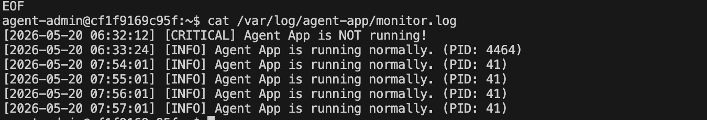

# 리눅스 서버 운영 및 자동화 미션 수행 내역서

## 1. 기본 보안 및 네트워크 설정

### 1-1. SSH 포트 변경 및 Root 원격 접속 차단
* **수행 목적:** 기본 포트(22)를 변경하고 최고 관리자 원격 접속을 막아 서버의 기본 보안을 강화함.
* **수행 설정:**
  * `Port 20022`로 변경
  * `PermitRootLogin no`로 설정

- 과제용 리눅스 서버 다시 설정
  ```bash
  docker run -it -p 20022:20022 -p 15034:15034 --name linux-mission ubuntu:22.04 /bin/bash
  apt update
  apt install -y sudo openssh-server ufw nano iproute2 systemctl
  ```

* **실행 명령어:**
  ```bash
  nano /etc/ssh/sshd_config
  service ssh restart
  ```

* **수행 증거**
  


### 1-2. 방화벽(UFW) 설정
* **수행 목적:** 필요한 포트(SSH, APP)만 허용하고 나머지는 차단하여 네트워크 보안 강화.
* **해결 과정 (Issue Log):**
  * 도커 컨테이너 내부에서 `ufw enable` 시 권한 문제(`Permission denied`) 및 읽기 전용 파일 시스템 에러 발생.
  * 기존 컨테이너를 이미지로 커밋(`docker commit`)한 후, `--privileged` 옵션을 부여하여 재실행함으로써 시스템 제어 권한 확보 및 해결.
  ```bash
  docker commit linux-mission my-ubuntu-v1
  docker rm -f linux-mission
  docker run -it --privileged -p 20022:20022 -p 15034:15034 --name linux-mission my-ubuntu-v1 /bin/bash
  ````

* **실행 명령어:**

  ```bash
  ufw default deny incoming      # 1. 들어오는 연결 기본 차단
  ufw default allow outgoing     # 2. 나가는 연결 기본 허용
  ufw allow 20022/tcp            # 3. 변경된 SSH 포트 허용
  ufw allow 15034/tcp            # 4. 파이썬 앱 포트 허용
  ufw allow 15034/tcp            
  ufw allow 15034/tcp            
  ufw enable                     # 5. 방화벽 활성화 
  ufw status                     # 6. 방화벽 상태 최종 확인
  ```

* **수행 증거**
  
  


## 2. 계정/그룹/권한 체계 구축 (협업 + 최소 권한)

* **수행 목적:**  역할 기반으로 계정과 그룹을 분리하여 협업 환경을 구축함.
  * ACL(접근 제어 목록)을 활용해 "공유 디렉토리(upload_files)"와 "보안 디렉토리(api_keys, log)"의 접근 권한을 철저히 분리하여 최소 권한의 원칙을 달성함.

* **계정 및 그룹 구성 내역:**
  * **그룹:** `agent-common` (전체 공통), `agent-core` (핵심 운영/개발)
  * **계정:** `agent-admin` (common, core 그룹 포함)
    * `agent-dev` (common, core 그룹 포함)
    * `agent-test` (common 그룹만 포함, core 제외)

* **디렉토리 권한 설정 내역:**
  * `upload_files`: `agent-common` 그룹 전체 R/W 허용
  * `api_keys` 및 `/var/log/agent-app`: `agent-core` 그룹 전용으로 R/W 허용 (test 계정 접근 원천 차단)

* **실행 명령어 (핵심 요약):**
  ```bash
  # 계정 및 그룹 설정
  groupadd agent-common && groupadd agent-core
  useradd -m -s /bin/bash agent-admin
  useradd -m -s /bin/bash agent-dev
  useradd -m -s /bin/bash agent-test
  usermod -aG agent-common,agent-core agent-admin
  usermod -aG agent-common agent-test

  # 디렉토리 생성 및 ACL 권한 부여
  mkdir -p /home/agent-admin/agent-app/upload_files
  mkdir -p /home/agent-admin/agent-app/api_keys
  mkdir -p /var/log/agent-app

  chown agent-admin:agent-core /home/agent-admin/agent-app/api_keys
  chmod 770 /home/agent-admin/agent-app/api_keys
  setfacl -m g:agent-core:rwx /home/agent-admin/agent-app/api_keys
  ```

* **수행 증거**
  


## 3. 애플리케이션 실행 환경 구성 및 일반 계정 구동 권한 최적화

### 3-1. 개요 및 보안 수립 목적
* **최소 권한의 원칙(Principle of Least Privilege) 적용:** 시스템 최고 관리자(`root`) 계정으로 애플리케이션 서비스를 직접 구동할 경우, 앱의 취약점을 통해 서버 전체의 제어권이 탈취될 치명적인 위험이 존재함. 이를 방지하기 위해 최소한의 권한만 가진 서비스 관리 전용 계정(`agent-admin`)을 주체로 하여 안전하게 구동 환경을 분리함.
* **환경 변수 기반 제어:** 소스코드 내부에 포트 번호나 파일 경로 등을 하드코딩(Hard-coding)하지 않고, 리눅스 시스템 환경 변수를 통해 앱 실행 환경을 동적이고 안전하게 관리함.

### 3-2. 상세 수행 내역 및 명령어 기록

#### ① API 인증용 비밀 키 파일 생성 및 소유권 제한
애플리케이션 검증에 사용될 핵심 암호화 키 파일을 생성하고, 무단 유출을 막기 위해 핵심 운영진 그룹(`agent-core`)에게만 읽기 권한을 부여함.

```bash
# agent-admin 홈 디렉토리 내부 보안 폴더에 키 파일 생성
echo "agent_api_key_test" > /home/agent-admin/agent-app/api_keys/t_secret.key

# 파일의 소유자를 agent-admin, 소유 그룹을 agent-core로 변경
chown agent-admin:agent-core /home/agent-admin/agent-app/api_keys/t_secret.key

# 권한을 640(u=rw, g=r, o=-)으로 변경하여 외부 유저(agent-test 등)의 접근을 원천 차단
chmod 640 /home/agent-admin/agent-app/api_keys/t_secret.key
```

#### ② 서비스 전용 계정 환경 변수 영구 등록 (`.bashrc`)
`agent-admin` 계정이 로그인할 때마다 앱 운영에 필요한 환경 변수들이 자동으로 로드되도록 쉘 설정 파일에 등록함.

```bash
# 환경 변수 추가 명령어 (agent-admin 계정 쉘 상태에서 수행)
echo 'export AGENT_HOME=/home/agent-admin/agent-app' >> ~/.bashrc
echo 'export AGENT_PORT=15034' >> ~/.bashrc
echo 'export AGENT_UPLOAD_DIR=$AGENT_HOME/upload_files' >> ~/.bashrc
echo 'export AGENT_KEY_PATH=$AGENT_HOME/api_keys/t_secret.key' >> ~/.bashrc
echo 'export AGENT_LOG_DIR=/var/log/agent-app' >> ~/.bashrc

# 변경된 설정 파일을 현재 쉘 세션에 즉시 반영
source ~/.bashrc
```

* **등록된 주요 환경 변수 상세 역할:**
  * `AGENT_HOME`: 애플리케이션 소스코드 및 핵심 데이터가 위치하는 최상위 경로 정의
  * `AGENT_PORT`: 서비스가 외부와 통신하기 위해 리슨(Listen)할 포트 번호 (`15034`) 명시
  * `AGENT_UPLOAD_DIR`: 클라이언트가 업로드하는 파일들이 안전하게 저장될 전용 공유 폴더 매핑
  * `AGENT_KEY_PATH`: 서버 검증용 내부 비밀 키 파일이 위치한 절대 경로 지정
  * `AGENT_LOG_DIR`: 앱 실행 중 발생하는 접속 및 에러 시스템 로그가 누적될 보안 로그 디렉토리 연동

#### ③ 애플리케이션 소스코드 배포 및 디렉토리 권한 트러블슈팅
* **이슈 사항:** 최초 `root` 계정 상태에서 생성한 상위 디렉토리(`agent-app`)의 소유권 제한으로 인해, 일반 계정(`agent-admin`) 전환 후 소스코드(`agent_app.py`) 파일 작성이 거부되는 `Permission denied` 에러 확인.
* **해결 조치:** 상위 관리 폴더의 소유권을 서비스 유저에게 정상 이양(`chown agent-admin:agent-core`)한 뒤 안전하게 코드를 작성하고 배포 완료함.

```bash
# 파이썬 애플리케이션 데몬 실행 명령어
python3 $AGENT_HOME/agent_app.py
```

### 3-3. 수행 결과 및 검증 데이터 (증거 자료)
* `root` 권한이 배제된 `agent-admin` 세션 상태에서 정상적으로 파이썬 스크립트가 실행됨을 검증함.
* 자체 부트 시퀀스(Boot Sequence) 검증 결과, 유저 권한 계정 식별, 환경 변수 정합성 체크, 비밀 키 무결성, 포트 가용성, 로그 디렉토리 쓰기 권한 테스트를 모두 에러 없이 통과(`[OK]`)하고 최종 **`Agent READY`** 상태로 15034번 포트가 리슨 상태에 진입함을 확인함.

* **수행 증거**
  


## 4. 시스템 관제 자동화 스크립트(monitor.sh) 및 로그 관리 구현

### 4-1. 개요 및 수행 목적
* **서비스 고가용성(HA) 및 자원 모니터링:** 실행 중인 애플리케이션 데몬의 상태(프로세스, 포트)와 시스템 자원(CPU, MEM, DISK)을 주기적으로 점검하고, 임계치 초과 시 경고를 기록하여 장애에 선제적으로 대응함.
* **로그 로테이션(Logrotate) 적용:** 모니터링 로그가 무한정 쌓여 디스크 풀(Disk Full) 장애를 유발하는 것을 방지하기 위해 10MB 단위로 10개까지만 보존하는 순환 정책을 적용함.

### 4-2. 상세 수행 내역 및 스크립트 소스코드

#### ① 관제 스크립트(`monitor.sh`) 작성 
`agent-dev`가 관리하는 `bin` 디렉토리에 환경 변수, Health Check, 자원 수집, 임계값 경고 로직이 모두 포함된 스크립트를 작성함.

```bash
# $AGENT_HOME/bin/monitor.sh 소스코드 작성
cat << 'EOF' > /home/agent-admin/agent-app/bin/monitor.sh
#!/bin/bash

export PATH=/usr/local/sbin:/usr/local/bin:/usr/sbin:/usr/bin:/sbin:/bin
AGENT_LOG_DIR=/var/log/agent-app
LOG_FILE=$AGENT_LOG_DIR/monitor.log
NOW=$(date "+%Y-%m-%d %H:%M:%S")

# 1. Health Check (비정상 시 즉시 종료 exit 1)
PID=$(pgrep -f agent_app.py)
if [ -z "$PID" ]; then exit 1; fi
if ! ss -tuln | grep -q ":15034"; then exit 1; fi

# 2. 상태 점검 (방화벽 비활성 체크)
WARN_MSG=""
if ! ufw status 2>/dev/null | grep -qw "active"; then
    WARN_MSG="$WARN_MSG [WARNING: UFW Inactive]"
fi

# 3. 자원 수집 (CPU, MEM, DISK)
CPU_USAGE=$(top -bn1 | grep "Cpu(s)" | awk '{print $2 + $4}')
MEM_USAGE=$(free | grep Mem | awk '{printf("%.0f", $3/$2 * 100)}')
DISK_USAGE=$(df / | tail -1 | awk '{print $5}' | sed 's/%//')

# 4. 임계값 경고
if [ $(echo "$CPU_USAGE > 20" | bc -l) -eq 1 ]; then WARN_MSG="$WARN_MSG [WARNING: CPU High]"; fi
if [ "$MEM_USAGE" -gt 10 ]; then WARN_MSG="$WARN_MSG [WARNING: MEM High]"; fi
if [ "$DISK_USAGE" -gt 80 ]; then WARN_MSG="$WARN_MSG [WARNING: DISK High]"; fi

# 5. 로그 기록 포맷팅
echo "[$NOW] PID:$PID CPU:${CPU_USAGE}% MEM:${MEM_USAGE}% DISK_USED:${DISK_USAGE}% $WARN_MSG" >> $LOG_FILE
EOF
```

#### ② 소유자 및 접근 권한(750) 정책 적용
스크립트의 소유권을 작성자인 `agent-dev`로, 그룹을 `agent-core`로 지정하고, 일반 유저의 접근을 막는 750 권한을 부여함.
```bash
chown agent-dev:agent-core /home/agent-admin/agent-app/bin/monitor.sh
chmod 750 /home/agent-admin/agent-app/bin/monitor.sh
```

#### ③ 로그 파일 용량 관리 (Logrotate)
`/etc/logrotate.d/agent-app` 설정 파일을 생성하여 10MB 초과 시 로테이션 및 최대 10개 파일 유지 정책을 등록함.
```bash
cat << 'EOF' > /etc/logrotate.d/agent-app
/var/log/agent-app/monitor.log {
    size 10M
    rotate 10
    missingok
    notifempty
    compress
    copytruncate
}
EOF
```

### 4-3. 수행 결과 및 검증 데이터 (증거 자료)
* 스크립트 수동 실행 및 크론을 통한 주기적 실행 결과, 요구되는 로그 포맷(`PID, CPU, MEM, DISK_USED`)이 정확히 출력됨을 확인함.

* **관제 스크립트 로깅 상태 확인**
  


## 5. 크론(Cron) 스케줄러 기반 자동화 구성

### 5-1. 개요 및 수행 목적
* **운영 자동화(Automation) 달성:** 관리자가 주기적으로 터미널에 접속하여 수동으로 관제 명령어를 수행하지 않더라도, 시스템 백그라운드에서 24시간 상시 모니터링 체계가 작동하도록 리눅스 표준 시간 기반 스케줄링 데몬인 `cron`을 도입함.
* **보안 최소 권한 원칙(Least Privilege) 고수:** 시스템 전역 스케줄러(`/etc/crontab`)나 최고 관리자(`root`) 권한의 크론탭을 사용할 경우, 감시 대상인 스크립트가 탈취되었을 때 시스템 전체 권한이 장악되는 위험(권한 에스컬레이션)이 존재함. 이를 방지하고자 해당 애플리케이션의 소유 계정인 `agent-admin` 고유의 사용자 크론탭 공간(`crontab -e`)에만 격리 등록함.

### 5-2. 상세 수행 내역 및 명령어 기록

#### ① 도커 환경 내 Cron 패키지 설치 및 데몬 활성화 (`root` 권한)
도커(Docker) 컨테이너 우분투 환경은 최소 기본 패키지만 포함하므로 스케줄러 데몬이 누락되어 있음. 이에 따라 최고 관리자 계정에서 패키지를 수동 빌드하고 백그라운드 서비스를 실행함.

```bash
# 1. 일반 계정 세션을 일시 종료하고 root 프롬프트로 복귀
exit

# 2. 패키지 저장소 최신화 및 자원 계산용 패키지, cron 데몬 설치 진행
apt update && apt install cron sysstat bc logrotate -y

# 3. 중지되어 있는 주기적 명령 스케줄러 백그라운드 서비스 기동
service cron start
```

#### ② 사용자 크론탭(Crontab) 스케줄링 규칙 정의
`agent-admin` 계정으로 안전하게 재전환한 후, 최소 관제 주기 요구사항에 맞추어 1분 단위 예약 명령을 삽입함.

```bash
# 1. 서비스 전용 관리자 계정으로 전환
su - agent-admin

# 2. 해당 계정 고유의 크론 스케줄 편집기 오픈
crontab -e

# 3. 편집기 최하단에 매 분마다 무조건 관제 스크립트를 밀어 넣는 스케줄링 규칙 선언 후 저장 (bin 경로 반영)
* * * * * /home/agent-admin/agent-app/bin/monitor.sh
```

### 5-3. 수행 결과 및 검증 데이터 (증거 자료)
* 설정이 완비된 직후 타임스탬프 시계가 정확히 1분 간격으로 자동 갱신되며 상태 확인 파일이 성공적으로 기록되는 것을 검증함.

```bash
# 자동 시스템 스케줄러 작동 여부를 파악하기 위한 최종 파일 데이터 출력 명령어
cat /var/log/agent-app/monitor.log
```

* **크론 스케줄러 자동 실행 로그 및 타임스탬프 분 단위 적재 완료 확인**
  
