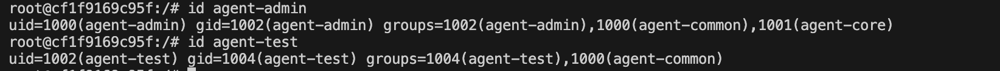

# 리눅스 서버 운영 및 자동화 미션 수행 내역서

## 1. 기본 보안 및 네트워크 설정

### 1-1. SSH 포트 변경 및 Root 원격 접속 차단
* **수행 목적:** 기본 포트(22)를 변경하고 최고 관리자 원격 접속을 막아 서버의 기본 보안을 강화함.
* **수행 설정:**
  * `Port 20022`로 변경
  * `PermitRootLogin no`로 설정

- 과제용 리눅스 서버 다시 설정
  ```bash
  docker run -it -p 20022:20022 -p 15034:15034 --name linux-mission ubuntu:22.04 /bin/bash
  apt update
  apt install -y sudo openssh-server ufw nano iproute2 systemctl
  ```

* **실행 명령어:**
  ```bash
  nano /etc/ssh/sshd_config
  service ssh restart
  ```

* **수행 증거**
  


### 1-2. 방화벽(UFW) 설정
* **수행 목적:** 필요한 포트(SSH, APP)만 허용하고 나머지는 차단하여 네트워크 보안 강화.
* **해결 과정 (Issue Log):**
  * 도커 컨테이너 내부에서 `ufw enable` 시 권한 문제(`Permission denied`) 및 읽기 전용 파일 시스템 에러 발생.
  * 기존 컨테이너를 이미지로 커밋(`docker commit`)한 후, `--privileged` 옵션을 부여하여 재실행함으로써 시스템 제어 권한 확보 및 해결.
  ```bash
  docker commit linux-mission my-ubuntu-v1
  docker rm -f linux-mission
  docker run -it --privileged -p 20022:20022 -p 15034:15034 --name linux-mission my-ubuntu-v1 /bin/bash
  ````

* **실행 명령어:**

  ```bash
  ufw default deny incoming      # 1. 들어오는 연결 기본 차단
  ufw default allow outgoing     # 2. 나가는 연결 기본 허용
  ufw allow 20022/tcp            # 3. 변경된 SSH 포트 허용
  ufw allow 15034/tcp            # 4. 파이썬 앱 포트 허용
  ufw allow 15034/tcp            
  ufw allow 15034/tcp            
  ufw enable                     # 5. 방화벽 활성화 
  ufw status                     # 6. 방화벽 상태 최종 확인
  ```

* **수행 증거**
  
  


## 2. 계정/그룹/권한 체계 구축 (협업 + 최소 권한)

* **수행 목적:**  역할 기반으로 계정과 그룹을 분리하여 협업 환경을 구축함.
  * ACL(접근 제어 목록)을 활용해 "공유 디렉토리(upload_files)"와 "보안 디렉토리(api_keys, log)"의 접근 권한을 철저히 분리하여 최소 권한의 원칙을 달성함.

* **계정 및 그룹 구성 내역:**
  * **그룹:** `agent-common` (전체 공통), `agent-core` (핵심 운영/개발)
  * **계정:** `agent-admin` (common, core 그룹 포함)
    * `agent-dev` (common, core 그룹 포함)
    * `agent-test` (common 그룹만 포함, core 제외)

* **디렉토리 권한 설정 내역:**
  * `upload_files`: `agent-common` 그룹 전체 R/W 허용
  * `api_keys` 및 `/var/log/agent-app`: `agent-core` 그룹 전용으로 R/W 허용 (test 계정 접근 원천 차단)

* **실행 명령어 (핵심 요약):**
  ```bash
  # 계정 및 그룹 설정
  groupadd agent-common && groupadd agent-core
  useradd -m -s /bin/bash agent-admin
  useradd -m -s /bin/bash agent-dev
  useradd -m -s /bin/bash agent-test
  usermod -aG agent-common,agent-core agent-admin
  usermod -aG agent-common agent-test

  # 디렉토리 생성 및 ACL 권한 부여
  mkdir -p /home/agent-admin/agent-app/upload_files
  mkdir -p /home/agent-admin/agent-app/api_keys
  mkdir -p /var/log/agent-app

  chown agent-admin:agent-core /home/agent-admin/agent-app/api_keys
  chmod 770 /home/agent-admin/agent-app/api_keys
  setfacl -m g:agent-core:rwx /home/agent-admin/agent-app/api_keys
  ```

* **수행 증거**
  


## 3. 애플리케이션 실행 환경 구성 및 일반 계정 구동 권한 최적화

### 3-1. 개요 및 보안 수립 목적
* **최소 권한의 원칙(Principle of Least Privilege) 적용:** 시스템 최고 관리자(`root`) 계정으로 애플리케이션 서비스를 직접 구동할 경우, 앱의 취약점을 통해 서버 전체의 제어권이 탈취될 치명적인 위험이 존재함. 이를 방지하기 위해 최소한의 권한만 가진 서비스 관리 전용 계정(`agent-admin`)을 주체로 하여 안전하게 구동 환경을 분리함.
* **환경 변수 기반 제어:** 소스코드 내부에 포트 번호나 파일 경로 등을 하드코딩(Hard-coding)하지 않고, 리눅스 시스템 환경 변수를 통해 앱 실행 환경을 동적이고 안전하게 관리함.

### 3-2. 상세 수행 내역 및 명령어 기록

#### ① API 인증용 비밀 키 파일 생성 및 소유권 제한
애플리케이션 검증에 사용될 핵심 암호화 키 파일을 생성하고, 무단 유출을 막기 위해 핵심 운영진 그룹(`agent-core`)에게만 읽기 권한을 부여함.

```bash
# agent-admin 홈 디렉토리 내부 보안 폴더에 키 파일 생성
echo "agent_api_key_test" > /home/agent-admin/agent-app/api_keys/t_secret.key

# 파일의 소유자를 agent-admin, 소유 그룹을 agent-core로 변경
chown agent-admin:agent-core /home/agent-admin/agent-app/api_keys/t_secret.key

# 권한을 640(u=rw, g=r, o=-)으로 변경하여 외부 유저(agent-test 등)의 접근을 원천 차단
chmod 640 /home/agent-admin/agent-app/api_keys/t_secret.key
```

#### ② 서비스 전용 계정 환경 변수 영구 등록 (`.bashrc`)
`agent-admin` 계정이 로그인할 때마다 앱 운영에 필요한 환경 변수들이 자동으로 로드되도록 쉘 설정 파일에 등록함.

```bash
# 환경 변수 추가 명령어 (agent-admin 계정 쉘 상태에서 수행)
echo 'export AGENT_HOME=/home/agent-admin/agent-app' >> ~/.bashrc
echo 'export AGENT_PORT=15034' >> ~/.bashrc
echo 'export AGENT_UPLOAD_DIR=$AGENT_HOME/upload_files' >> ~/.bashrc
echo 'export AGENT_KEY_PATH=$AGENT_HOME/api_keys/t_secret.key' >> ~/.bashrc
echo 'export AGENT_LOG_DIR=/var/log/agent-app' >> ~/.bashrc

# 변경된 설정 파일을 현재 쉘 세션에 즉시 반영
source ~/.bashrc
```

* **등록된 주요 환경 변수 상세 역할:**
  * `AGENT_HOME`: 애플리케이션 소스코드 및 핵심 데이터가 위치하는 최상위 경로 정의
  * `AGENT_PORT`: 서비스가 외부와 통신하기 위해 리슨(Listen)할 포트 번호 (`15034`) 명시
  * `AGENT_UPLOAD_DIR`: 클라이언트가 업로드하는 파일들이 안전하게 저장될 전용 공유 폴더 매핑
  * `AGENT_KEY_PATH`: 서버 검증용 내부 비밀 키 파일이 위치한 절대 경로 지정
  * `AGENT_LOG_DIR`: 앱 실행 중 발생하는 접속 및 에러 시스템 로그가 누적될 보안 로그 디렉토리 연동

#### ③ 애플리케이션 소스코드 배포 및 디렉토리 권한 트러블슈팅
* **이슈 사항:** 최초 `root` 계정 상태에서 생성한 상위 디렉토리(`agent-app`)의 소유권 제한으로 인해, 일반 계정(`agent-admin`) 전환 후 소스코드(`agent_app.py`) 파일 작성이 거부되는 `Permission denied` 에러 확인.
* **해결 조치:** 상위 관리 폴더의 소유권을 서비스 유저에게 정상 이양(`chown agent-admin:agent-core`)한 뒤 안전하게 코드를 작성하고 배포 완료함.

```bash
# 파이썬 애플리케이션 데몬 실행 명령어
python3 $AGENT_HOME/agent_app.py
```

### 3-3. 수행 결과 및 검증 데이터 (증거 자료)
* `root` 권한이 배제된 `agent-admin` 세션 상태에서 정상적으로 파이썬 스크립트가 실행됨을 검증함.
* 자체 부트 시퀀스(Boot Sequence) 검증 결과, 유저 권한 계정 식별, 환경 변수 정합성 체크, 비밀 키 무결성, 포트 가용성, 로그 디렉토리 쓰기 권한 테스트를 모두 에러 없이 통과(`[OK]`)하고 최종 **`Agent READY`** 상태로 15034번 포트가 리슨 상태에 진입함을 확인함.

* **수행 증거**
  


## 4. 시스템 관제 자동화 및 로깅 스크립트 구축

### 4-1. 개요 및 수행 목적
* **서비스 고가용성(HA) 확보 기반 마련:** 실행 중인 애플리케이션 데몬이 예기치 않게 종료되는 상황을 신속하게 파악하기 위해, 프로세스 상태를 점검하는 쉘 스크립트를 작성함.
* **자동화된 상태 로깅(Logging):** 관리자가 수동으로 확인하지 않아도, 스크립트 실행 시점의 타임스탬프와 함께 데몬의 생존 여부(PID)를 지정된 보안 로그 디렉토리에 누적 기록하도록 구성함.

### 4-2. 상세 수행 내역 및 명령어 기록

#### ① 모니터링 스크립트(`monitor.sh`) 작성 및 로직 구현
`agent-admin` 계정 환경에서 동작하며, `pgrep` 명령어를 활용해 파이썬 앱의 프로세스 ID(PID)를 추출하고 조건문으로 상태를 판별하는 스크립트를 작성함.

```bash
# 스크립트 생성
cat << 'EOF' > $AGENT_HOME/monitor.sh
#!/bin/bash

# 로그 파일 위치 지정 및 타임스탬프 생성
LOG_FILE=$AGENT_LOG_DIR/monitor.log
NOW=$(date "+%Y-%m-%d %H:%M:%S")

# 파이썬 앱(agent_app.py)의 프로세스 번호(PID)를 조회
PID=$(pgrep -f agent_app.py)

# PID 존재 여부에 따른 분기 처리
if [ -z "$PID" ]; then
    # 앱 프로세스가 존재하지 않을 경우 CRITICAL 로그 작성
    echo "[$NOW] [CRITICAL] Agent App is NOT running!" >> $LOG_FILE
else
    # 앱 프로세스가 존재할 경우 INFO 로그와 함께 PID 기록
    echo "[$NOW] [INFO] Agent App is running normally. (PID: $PID)" >> $LOG_FILE
fi
EOF
```

#### ② 스크립트 실행 권한(Executable) 부여
단순 텍스트 파일로 생성된 스크립트가 시스템에서 프로그램으로 동작할 수 있도록 `chmod` 명령어를 통해 실행 권한을 부여함.

```bash
# 실행 권한 추가
chmod +x $AGENT_HOME/monitor.sh
```

### 4-3. 수행 결과 및 검증 데이터 (증거 자료)
* 스크립트 구동 후 `/var/log/agent-app/monitor.log` 파일을 확인하여 조건부 로깅이 정확히 동작하는지 테스트함.
* 프로세스가 없을 때의 비정상 상태(`[CRITICAL]`)와, 백그라운드에서 실행 중일 때의 정상 상태(`[INFO]`)가 각각의 타임스탬프와 함께 완벽하게 기록됨을 확인함.

* **관제 스크립트 로깅 상태 확인**
  