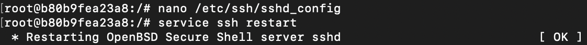
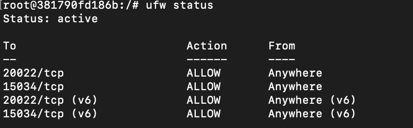
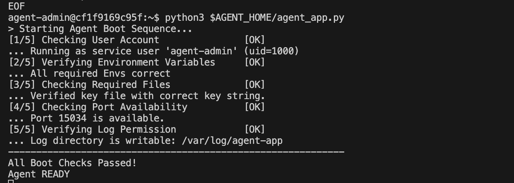
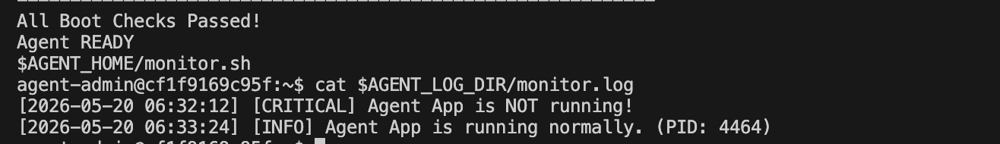

# 리눅스 서버 운영 및 자동화 미션 수행 내역서
  
> **환경:** Ubuntu 22.04 LTS (Docker 컨테이너 기반)  
> **과제 목표:** 다중 사용자 환경에서의 보안·권한 관리, 애플리케이션 배포, 시스템 관제 자동화 파이프라인 구축

---

## 1. 기본 보안 및 네트워크 설정

### 1-1. SSH 포트 변경 및 Root 원격 접속 차단

#### 📌 개념 설명 — SSH 보안이 "기본 중의 기본"인 이유

SSH(Secure Shell)는 원격에서 서버를 관리하기 위한 프로토콜로, 사실상 서버의 "정문"에 해당한다. 기본 포트인 `22번`은 전 세계적으로 알려져 있어, 자동화된 무차별 대입(Brute-force) 공격 봇들이 가장 먼저 시도하는 대상이다.

| 보안 조치 | 적용 전 위험 | 적용 후 효과 |
|-----------|-------------|-------------|
| **포트 변경 (22 → 20022)** | 봇이 기본 포트 22를 자동으로 스캔하여 침입 시도 | 비표준 포트 사용으로 자동화 공격 대부분 회피 |
| **Root 로그인 차단** | root 계정 탈취 시 서버 전체 제어권 상실 | 일반 계정 → sudo 2단계 인증 구조로 피해 범위 제한 |

> **💡 핵심 원리:**  
> 포트 변경은 "보안을 통한 난독화(Security through Obscurity)"로, 단독으로는 완벽하지 않지만, 키 기반 인증, fail2ban 등과 결합하면 방어 계층(Defense in Depth)을 형성한다.  
> Root 원격 접속 차단은 **최소 권한의 원칙(Principle of Least Privilege)** 의 가장 기초적 적용으로, 공격자가 root 비밀번호를 알아내더라도 원격으로 직접 접속하는 것 자체를 불가능하게 만든다.

#### 수행 설정

* `Port 20022`로 변경 — sshd가 리슨하는 포트를 비표준 포트로 전환
* `PermitRootLogin no`로 설정 — root 계정의 SSH 원격 로그인을 완전 차단

#### 환경 구성 (Docker 컨테이너)

과제 전용 리눅스 실습 환경을 Docker 컨테이너로 구축하였다. 호스트에서 SSH(20022)와 앱 포트(15034)를 포워딩하여 외부 접근이 가능하도록 설정하였다.

```bash
# 컨테이너 생성 시 포트 포워딩으로 SSH와 앱 포트를 호스트에 매핑
docker run -it -p 20022:20022 -p 15034:15034 --name linux-mission ubuntu:22.04 /bin/bash

# 필수 패키지 설치 (SSH 서버, 방화벽, 편집기, 네트워크 도구 등)
apt update
apt install -y sudo openssh-server ufw nano iproute2 systemctl
```

#### 실행 명령어

```bash
# SSH 설정 파일을 열어 Port와 PermitRootLogin 항목을 수정
nano /etc/ssh/sshd_config
# ──────────────────────────
# 아래 두 줄을 찾아 수정:
#   Port 20022
#   PermitRootLogin no
# ──────────────────────────

# 변경된 설정을 적용하기 위해 SSH 데몬 재시작
service ssh restart
```

#### 확인 방법

```bash
# sshd 설정 파일에서 포트와 PermitRootLogin 설정값을 직접 확인
grep -E "^Port|^PermitRootLogin" /etc/ssh/sshd_config

# sshd가 실제로 20022 포트에서 리슨하고 있는지 확인
ss -tulnp | grep sshd
```

#### 수행 증거



---

### 1-2. 방화벽(UFW) 설정

#### 📌 개념 설명 — 방화벽(Firewall)과 "기본 거부(Default Deny)" 정책

방화벽은 네트워크 트래픽을 필터링하여 허용된 연결만 통과시키는 보안 장벽이다. **UFW(Uncomplicated Firewall)** 는 Ubuntu에서 iptables를 쉽게 관리할 수 있도록 만든 프론트엔드 도구이다.

```
[인터넷] ──→ [방화벽(UFW)] ──→ [서버 내부 서비스]
                  │
                  ├─ 20022/tcp(SSH)  → ✅ ALLOW (허용)
                  ├─ 15034/tcp(APP)  → ✅ ALLOW (허용)
                  └─ 그 외 모든 포트   → ❌ DENY  (차단)
```

> **💡 기본 거부(Default Deny) 원칙:**  
> "명시적으로 허용하지 않은 모든 것은 차단한다"는 원칙이다. 반대 개념인 Default Allow(기본 허용)는 관리자가 모든 위험 포트를 미리 예측하고 하나씩 차단해야 하므로 누락 위험이 높다. Default Deny 방식에서는 새로운 서비스를 추가할 때만 해당 포트를 명시적으로 열면 되므로, 보안 기본 체계가 훨씬 견고하다.

> **💡 UFW vs firewalld:**  
> - **UFW**: Ubuntu/Debian 계열에서 기본 제공. 명령어가 직관적이고 단순하여 빠른 설정에 유리  
> - **firewalld**: RHEL/CentOS 계열에서 기본 제공. Zone 기반 관리로 복잡한 네트워크 토폴로지에 적합  
> 본 과제에서는 Ubuntu 22.04 환경이므로 **UFW**를 선택하였다.

#### 해결 과정 (Issue Log)

도커 컨테이너 내부에서 `ufw enable` 실행 시 `Permission denied` 및 읽기 전용 파일 시스템(`/proc/sys/net/...`) 에러가 발생하였다. 이는 도커 컨테이너가 기본적으로 네트워크 네임스페이스에 대한 커널 레벨 제어 권한을 가지지 않기 때문이다.

**해결 방법:** 기존 컨테이너의 상태를 이미지로 저장(`docker commit`)한 후, `--privileged` 플래그를 부여하여 재실행함으로써 호스트 커널의 시스템 제어 권한을 컨테이너에 부여하였다.

```bash
# 현재 컨테이너 상태를 이미지로 커밋 (설치한 패키지 보존)
docker commit linux-mission my-ubuntu-v1

# 기존 권한 제한 컨테이너 삭제
docker rm -f linux-mission

# --privileged 옵션으로 커널 레벨 제어 권한 부여하여 재생성
docker run -it --privileged -p 20022:20022 -p 15034:15034 --name linux-mission my-ubuntu-v1 /bin/bash
```

#### 실행 명령어

```bash
# 1. 들어오는 모든 연결을 기본 차단 (Default Deny Incoming)
ufw default deny incoming

# 2. 나가는 연결은 기본 허용 (서버에서 외부로의 통신은 허용)
ufw default allow outgoing

# 3. 변경된 SSH 포트만 허용 (이전 단계에서 22→20022 변경)
ufw allow 20022/tcp

# 4. 파이썬 애플리케이션 서비스 포트 허용
ufw allow 15034/tcp

# 5. 방화벽 활성화 (이 시점부터 규칙이 적용됨)
ufw enable

# 6. 최종 방화벽 상태 확인
ufw status
```

#### 확인 방법

```bash
# 방화벽 상태 및 등록된 규칙 목록 확인
ufw status verbose
# 기대 결과: Status: active, 20022/tcp ALLOW, 15034/tcp ALLOW
```

#### 수행 증거



---

## 2. 계정/그룹/권한 체계 구축 (협업 + 최소 권한)

#### 📌 개념 설명 — 역할 기반 접근 제어(RBAC)와 ACL

리눅스에서는 사용자(User)와 그룹(Group)을 기반으로 파일/디렉토리에 대한 접근 권한을 제어한다. 하지만 전통적인 `chmod`(소유자/그룹/기타) 3단 구조만으로는 **"그룹 A에게는 읽기/쓰기를, 그룹 B에게는 읽기만"** 같은 세밀한 정책을 표현하기 어렵다.

이때 사용하는 것이 **ACL(Access Control List)** 이다. ACL을 사용하면 기본 소유 그룹 외에 추가 그룹/사용자별로 개별 권한을 부여할 수 있어, 실무의 역할 기반 접근 제어(RBAC)를 구현할 수 있다.

```
┌─────────────────────────────────────────────────────────┐
│                    그룹 및 권한 구조도                      │
├─────────────────────────────────────────────────────────┤
│                                                         │
│  agent-common (공통 그룹)       agent-core (핵심 그룹)     │
│  ├── agent-admin  ◄────────►  ├── agent-admin            │
│  ├── agent-dev    ◄────────►  └── agent-dev              │
│  └── agent-test   (core 미포함 = 보안 디렉토리 접근 불가)  │
│                                                         │
│  upload_files/    → agent-common R/W  (전체 공유)        │
│  api_keys/        → agent-core  R/W  (핵심만 접근)       │
│  /var/log/agent-app → agent-core R/W (핵심만 접근)       │
└─────────────────────────────────────────────────────────┘
```

> **💡 왜 공유 디렉토리와 보안 디렉토리를 분리하는가?**  
> 실무에서 QA/테스트 담당자에게 API 키나 운영 로그에 대한 쓰기 권한을 부여하면, 키 유출·로그 변조 등의 보안 사고 위험이 급격히 높아진다. 파일 업로드 등 협업에 필요한 공유 공간은 열어두되, 인증 키·민감 로그 등은 핵심 운영 인력에게만 접근을 허용하는 것이 **최소 권한의 원칙(Principle of Least Privilege)** 이다.

> **💡 전통적 chmod vs ACL 비교:**
> | 구분 | chmod (전통 방식) | ACL (setfacl) |
> |------|------------------|---------------|
> | 그룹 지정 | 소유 그룹 1개만 | 여러 그룹/유저에 개별 권한 |
> | 세밀도 | 소유자/그룹/기타 3단 | 유저/그룹 단위 무제한 |
> | 확인 명령 | `ls -l` | `getfacl` |
> | 적용 명령 | `chmod 770 file` | `setfacl -m g:group:rwx file` |

#### 계정 및 그룹 구성 내역

| 계정 | 역할 | 소속 그룹 | 설명 |
|------|------|-----------|------|
| `agent-admin` | 운영/관리, cron 실행자 | agent-common, **agent-core** | 앱 소유자, 모니터링 스케줄 관리 |
| `agent-dev` | 개발/운영, monitor.sh 작성자 | agent-common, **agent-core** | 스크립트 개발 및 유지보수 |
| `agent-test` | QA/테스트 | agent-common | 공유 파일만 접근 가능, 보안 영역 접근 불가 |

#### 디렉토리 권한 설정 내역

| 디렉토리 | 소유 그룹 | 접근 권한 | 목적 |
|----------|----------|----------|------|
| `upload_files` | agent-common | 전체 R/W 허용 | 파일 업로드 공유 공간 |
| `api_keys` | agent-core | 핵심 인력만 R/W | API 키 등 보안 자산 보관 |
| `/var/log/agent-app` | agent-core | 핵심 인력만 R/W | 운영 로그 보안 보관 |

#### 실행 명령어

```bash
# ──── 그룹 생성 ────
groupadd agent-common    # 전체 공통 그룹
groupadd agent-core      # 핵심 운영/개발 그룹

# ──── 계정 생성 (-m: 홈 디렉토리 자동 생성, -s: 로그인 쉘 지정) ────
useradd -m -s /bin/bash agent-admin
useradd -m -s /bin/bash agent-dev
useradd -m -s /bin/bash agent-test

# ──── 그룹 멤버십 할당 (-aG: 기존 그룹 유지하면서 추가) ────
usermod -aG agent-common,agent-core agent-admin   # admin → common + core
usermod -aG agent-common,agent-core agent-dev     # dev   → common + core
usermod -aG agent-common agent-test               # test  → common ONLY

# ──── 디렉토리 구조 생성 ────
mkdir -p /home/agent-admin/agent-app/upload_files
mkdir -p /home/agent-admin/agent-app/api_keys
mkdir -p /var/log/agent-app

# ──── upload_files: agent-common 그룹에 R/W 권한 부여 ────
chown agent-admin:agent-common /home/agent-admin/agent-app/upload_files
chmod 770 /home/agent-admin/agent-app/upload_files
setfacl -m g:agent-common:rwx /home/agent-admin/agent-app/upload_files

# ──── api_keys: agent-core 그룹에만 R/W 권한 부여 ────
chown agent-admin:agent-core /home/agent-admin/agent-app/api_keys
chmod 770 /home/agent-admin/agent-app/api_keys
setfacl -m g:agent-core:rwx /home/agent-admin/agent-app/api_keys

# ──── /var/log/agent-app: agent-core 그룹에만 R/W 권한 부여 ────
chown agent-admin:agent-core /var/log/agent-app
chmod 770 /var/log/agent-app
setfacl -m g:agent-core:rwx /var/log/agent-app
```

#### 확인 방법

```bash
# 각 계정의 소속 그룹 확인
id agent-admin   # groups: agent-common, agent-core
id agent-dev     # groups: agent-common, agent-core
id agent-test    # groups: agent-common (core 미포함)

# 디렉토리 소유권 및 기본 권한 확인
ls -la /home/agent-admin/agent-app/

# ACL 세부 권한 확인 (setfacl로 설정한 추가 권한 표시)
getfacl /home/agent-admin/agent-app/upload_files
getfacl /home/agent-admin/agent-app/api_keys
getfacl /var/log/agent-app
```

#### 수행 증거


---

## 3. 애플리케이션 실행 환경 구성 및 일반 계정 구동

### 3-1. 개요 및 보안 수립 목적

#### 📌 개념 설명 — 왜 root로 앱을 실행하면 안 되는가?

```
[ 공격 시나리오 비교 ]

❌ root로 앱 실행 시:
   공격자 → 앱 취약점 악용 → root 권한 획득 → 서버 전체 장악 (파일 삭제, 백도어 설치 등)

✅ 일반 계정으로 앱 실행 시:
   공격자 → 앱 취약점 악용 → agent-admin 권한만 획득 → 해당 계정 범위 내로 피해 제한
                                                      (시스템 파일 접근 불가, sudo 없이 권한 상승 불가)
```

> **💡 최소 권한의 원칙(Principle of Least Privilege):**  
> 모든 프로그램과 사용자는 업무 수행에 **필요한 최소한의 권한**만 부여받아야 한다. root는 리눅스에서 모든 제한이 해제된 "슈퍼유저"이므로, 애플리케이션이 root로 실행되면 취약점 하나가 서버 전체를 위험에 빠뜨린다.

#### 📌 개념 설명 — 환경 변수(Environment Variable)로 실행 환경을 고정하는 이유

환경 변수란 운영체제가 프로세스에게 제공하는 **키=값** 형태의 설정 데이터이다. 코드 내부에 경로·포트 번호 등을 하드코딩(Hard-coding)하면 다음과 같은 문제가 생긴다:

| 문제 | 하드코딩 방식 | 환경 변수 방식 |
|------|-------------|---------------|
| 환경 변경 시 | 소스코드 수정 + 재배포 필요 | 환경 변수만 변경하면 즉시 반영 |
| 보안 (API 키 등) | 소스코드에 노출 → Git 등에 유출 위험 | 환경 변수로 분리 → 코드와 비밀 정보 격리 |
| 개발/스테이징/운영 분리 | 환경별 코드 분기 필요 | 동일 코드 + 환경별 변수만 교체 |

> **💡 검증 방법:** `echo $AGENT_HOME` 명령으로 현재 쉘 세션에서 환경 변수가 올바르게 설정되어 있는지 확인할 수 있으며, `.bashrc`에 등록하면 로그인 시마다 자동으로 로드된다.

### 3-2. 상세 수행 내역 및 명령어 기록

#### ① API 인증용 비밀 키 파일 생성 및 소유권 제한

애플리케이션 검증에 사용될 핵심 암호화 키 파일을 생성하고, 무단 유출을 막기 위해 핵심 운영진 그룹(`agent-core`)에게만 읽기 권한을 부여한다.

```bash
# agent-admin 홈 디렉토리 내부 보안 폴더에 키 파일 생성
echo "agent_api_key_test" > /home/agent-admin/agent-app/api_keys/t_secret.key

# 파일의 소유자를 agent-admin, 소유 그룹을 agent-core로 변경
chown agent-admin:agent-core /home/agent-admin/agent-app/api_keys/t_secret.key

# 권한을 640(u=rw, g=r, o=-)으로 변경하여 외부 유저(agent-test 등)의 접근을 원천 차단
chmod 640 /home/agent-admin/agent-app/api_keys/t_secret.key
```

> **💡 권한 640의 의미:**  
> `6`(소유자) = r(4) + w(2) = 읽기+쓰기  
> `4`(그룹) = r(4) = 읽기만  
> `0`(기타) = 접근 불가  
> → agent-admin은 수정 가능, agent-core 그룹원은 읽기만, 그 외(agent-test 등)는 접근 불가

#### ② 서비스 전용 계정 환경 변수 영구 등록 (`.bashrc`)

`agent-admin` 계정이 로그인할 때마다 앱 운영에 필요한 환경 변수들이 자동으로 로드되도록 쉘 설정 파일에 등록한다.

```bash
# 환경 변수 추가 명령어 (agent-admin 계정 쉘 상태에서 수행)
echo 'export AGENT_HOME=/home/agent-admin/agent-app' >> ~/.bashrc
echo 'export AGENT_PORT=15034' >> ~/.bashrc
echo 'export AGENT_UPLOAD_DIR=$AGENT_HOME/upload_files' >> ~/.bashrc
echo 'export AGENT_KEY_PATH=$AGENT_HOME/api_keys/t_secret.key' >> ~/.bashrc
echo 'export AGENT_LOG_DIR=/var/log/agent-app' >> ~/.bashrc

# 변경된 설정 파일을 현재 쉘 세션에 즉시 반영
source ~/.bashrc
```

**등록된 주요 환경 변수 상세 역할:**

| 환경 변수 | 값 | 역할 |
|-----------|-----|------|
| `AGENT_HOME` | `/home/agent-admin/agent-app` | 애플리케이션 소스코드 및 핵심 데이터가 위치하는 최상위 경로. 모든 하위 경로의 기준점 |
| `AGENT_PORT` | `15034` | 서비스가 외부와 통신하기 위해 리슨(Listen)할 TCP 포트 번호 |
| `AGENT_UPLOAD_DIR` | `$AGENT_HOME/upload_files` | 클라이언트가 업로드하는 파일들이 저장될 공유 디렉토리 경로 |
| `AGENT_KEY_PATH` | `$AGENT_HOME/api_keys/t_secret.key` | 서버 검증용 내부 비밀 키 파일의 절대 경로 |
| `AGENT_LOG_DIR` | `/var/log/agent-app` | 앱 실행 중 발생하는 시스템 로그가 누적될 보안 로그 디렉토리 |

#### ③ 애플리케이션 소스코드 배포 및 디렉토리 권한 트러블슈팅

* **이슈 사항:** 최초 `root` 계정 상태에서 생성한 상위 디렉토리(`agent-app`)의 소유권이 root로 되어 있어, 일반 계정(`agent-admin`)으로 전환 후 소스코드(`agent_app.py`) 파일 작성 시 `Permission denied` 에러가 발생하였다.
* **원인 분석:** `mkdir -p`로 디렉토리를 생성할 때 root 세션에서 실행하면, 생성된 디렉토리의 소유자가 root가 되므로 하위 파일 생성 권한이 일반 계정에 없는 상태였다.
* **해결 조치:** 상위 관리 폴더의 소유권을 서비스 유저에게 정상 이양(`chown agent-admin:agent-core`)한 뒤, 안전하게 코드를 작성하고 배포 완료하였다.

```bash
# 디렉토리 소유권을 서비스 계정에게 이양
chown -R agent-admin:agent-core /home/agent-admin/agent-app

# agent-admin 계정으로 전환
su - agent-admin

# 파이썬 애플리케이션 실행
python3 $AGENT_HOME/agent_app.py
```

### 3-3. 수행 결과 및 검증 데이터 (증거 자료)

`root` 권한이 배제된 `agent-admin` 세션 상태에서 정상적으로 파이썬 스크립트가 실행됨을 검증하였다.

**자체 부트 시퀀스(Boot Sequence) 검증 항목:**

| 단계 | 검증 내용 | 결과 |
|------|-----------|------|
| [1/5] | 실행 계정이 root가 아닌 일반 서비스 계정인지 확인 | ✅ OK — `agent-admin (uid=1000)` |
| [2/5] | 필수 환경 변수 5개가 모두 정상 설정되어 있는지 확인 | ✅ OK — All required Envs correct |
| [3/5] | API 키 파일이 존재하고 내용이 정확한지 확인 | ✅ OK — Verified key file |
| [4/5] | 지정 포트(15034)가 다른 서비스에 점유되지 않았는지 확인 | ✅ OK — Port 15034 available |
| [5/5] | 로그 디렉토리에 쓰기 권한이 있는지 확인 | ✅ OK — `/var/log/agent-app` writable |

최종적으로 **`Agent READY`** 상태로 `0.0.0.0:15034` 포트가 LISTEN 상태에 진입하였다.

#### 수행 증거



---

## 4. 시스템 관제 자동화 스크립트(monitor.sh) 및 로그 관리 구현

### 4-1. 개요 및 수행 목적

#### 📌 개념 설명 — 왜 시스템 모니터링 자동화가 필요한가?

서버 장애는 대부분 **CPU 폭주, 메모리 부족, 디스크 풀(Disk Full), 프로세스 다운** 중 하나에서 시작된다. 이를 사람이 수동으로 매번 확인하는 것은 비현실적이며, 장애 발생 시점의 데이터가 없으면 원인 분석이 불가능하다.

```
[ 모니터링 자동화 파이프라인 ]

 crontab (매분 실행)
     │
     ▼
 monitor.sh 스크립트
     │
     ├─ [STEP 1] Health Check  ───→ 프로세스 & 포트 확인 (실패 시 exit 1)
     ├─ [STEP 2] 상태 점검     ───→ 방화벽 활성 여부 (WARNING 출력)
     ├─ [STEP 3] 자원 수집     ───→ CPU / MEM / DISK 사용률 측정
     ├─ [STEP 4] 임계값 경고   ───→ 기준 초과 시 WARNING 출력
     ├─ [STEP 5] 로그 기록     ───→ monitor.log에 한 줄 추가
     └─ [STEP 6] 로그 용량 관리 ──→ 10MB 초과 시 자동 로테이션
                                           │
                                           ▼
                                  /var/log/agent-app/monitor.log
                                  (누적 기록 → 장애 원인 추적 가능)
```

> **💡 Health Check 실패 시 `exit 1`로 종료하는 이유:**  
> 프로세스가 죽거나 포트가 리슨하지 않는 상황에서 자원 수집을 계속하면, 의미 없는 데이터가 로그에 쌓인다. Health Check를 가장 먼저 실행하고 실패 시 즉시 종료하여, 로그 파일에는 **"정상 상태의 데이터만 기록"** 되도록 설계한다. 또한 `exit 1` 반환 코드를 통해 cron 로그에서 실패 이력을 추적할 수 있다.

> **💡 임계값 경고를 "경고만 출력, 종료하지 않음"으로 설계한 이유:**  
> CPU나 메모리 사용률이 임계값을 일시적으로 초과하는 것은 정상 부하 상황에서도 발생할 수 있다. 이때 스크립트를 종료하면 이후 자원 변화를 추적할 수 없게 된다. 경고만 기록하고 계속 실행하여 **추세 데이터(Trend Data)** 를 확보하는 것이 실무에서의 표준 운영 관행이다.

### 4-2. 상세 수행 내역 및 스크립트 소스코드

#### ① 관제 스크립트(`monitor.sh`) 주요 로직 해설

| 구간 | 명령어 | 설명 |
|------|--------|------|
| 프로세스 확인 | `pgrep -f agent_app.py` | `-f` 옵션으로 전체 명령행에서 패턴 검색. PID 반환 없으면 미실행 판정 |
| 포트 확인 | `ss -tuln \| grep ":15034"` | `ss`는 `netstat`의 현대적 대체 명령어. `-t`(TCP) `-u`(UDP) `-l`(LISTEN) `-n`(숫자 표시) |
| 방화벽 확인 | `ufw status` | "active" 문자열 포함 여부로 활성 상태 판별 |
| CPU 측정 | `top -bn1` | `-b`(배치 모드) `-n1`(1회만 실행) 후 user+system 합산으로 CPU 사용률 산출 |
| 메모리 측정 | `free \| grep Mem` | 사용 메모리 / 전체 메모리 × 100 = 사용률(%) |
| 디스크 측정 | `df / \| tail -1` | 루트 파티션(/)의 사용률(%) 추출 |
| 부동소수점 비교 | `echo "$CPU > 20" \| bc -l` | bash는 정수 비교만 지원하므로, CPU 값(소수점)은 `bc` 계산기 사용 |

#### ② 스크립트 소스코드 (`$AGENT_HOME/bin/monitor.sh`)

```bash
#!/bin/bash
# ============================================================
# monitor.sh - 시스템 상태 수집 및 로깅 자동화 스크립트
# 위치: $AGENT_HOME/bin/monitor.sh
# 소유: agent-dev:agent-core | 권한: 750 (rwxr-x---)
# 실행: agent-admin (crontab 매분 자동 실행)
# ============================================================

# --- 공통 환경 설정 ---
export PATH=/usr/local/sbin:/usr/local/bin:/usr/sbin:/usr/bin:/sbin:/bin
AGENT_LOG_DIR=/var/log/agent-app
LOG_FILE=$AGENT_LOG_DIR/monitor.log
MAX_LOG_SIZE=10485760   # 10MB (10 * 1024 * 1024)
MAX_LOG_FILES=10
NOW=$(date "+%Y-%m-%d %H:%M:%S")

# [STEP 1] Health Check – 프로세스 & 포트 상태 확인
PID=$(pgrep -f agent_app.py)
if [ -z "$PID" ]; then
    echo "[$NOW] [CRITICAL] agent_app.py process NOT found." >> $LOG_FILE
    exit 1
fi
if ! ss -tuln | grep -q ":15034"; then
    echo "[$NOW] [CRITICAL] Port 15034 NOT listening." >> $LOG_FILE
    exit 1
fi

# [STEP 2] 상태 점검 – 방화벽(UFW) 활성 여부
WARN_MSG=""
if ! ufw status 2>/dev/null | grep -qw "active"; then
    WARN_MSG="$WARN_MSG [WARNING: UFW Inactive]"
fi

# [STEP 3] 자원 수집 – CPU / MEM / DISK 사용률
CPU_USAGE=$(top -bn1 | grep "Cpu(s)" | awk '{print $2 + $4}')
MEM_USAGE=$(free | grep Mem | awk '{printf("%.0f", $3/$2 * 100)}')
DISK_USAGE=$(df / | tail -1 | awk '{print $5}' | sed 's/%//')

# [STEP 4] 임계값 경고
if [ $(echo "$CPU_USAGE > 20" | bc -l) -eq 1 ]; then WARN_MSG="$WARN_MSG [WARNING: CPU High]"; fi
if [ "$MEM_USAGE" -gt 10 ]; then WARN_MSG="$WARN_MSG [WARNING: MEM High]"; fi
if [ "$DISK_USAGE" -gt 80 ]; then WARN_MSG="$WARN_MSG [WARNING: DISK High]"; fi

# [STEP 5] 로그 기록
echo "[$NOW] PID:$PID CPU:${CPU_USAGE}% MEM:${MEM_USAGE}% DISK_USED:${DISK_USAGE}% $WARN_MSG" >> $LOG_FILE

# [STEP 6] 로그 파일 용량 관리 (10MB 초과 시 로테이션)
if [ -f "$LOG_FILE" ]; then
    FILE_SIZE=$(stat -c%s "$LOG_FILE" 2>/dev/null || echo 0)
    if [ "$FILE_SIZE" -gt "$MAX_LOG_SIZE" ]; then
        [ -f "${LOG_FILE}.${MAX_LOG_FILES}" ] && rm -f "${LOG_FILE}.${MAX_LOG_FILES}"
        for i in $(seq $((MAX_LOG_FILES - 1)) -1 1); do
            [ -f "${LOG_FILE}.${i}" ] && mv "${LOG_FILE}.${i}" "${LOG_FILE}.$((i + 1))"
        done
        mv "$LOG_FILE" "${LOG_FILE}.1"
        touch "$LOG_FILE"
    fi
fi
```

#### ③ 소유자 및 접근 권한(750) 정책 적용

스크립트의 소유권을 작성자인 `agent-dev`로, 그룹을 `agent-core`로 지정하고, 일반 유저의 접근을 막는 750 권한을 부여한다.

```bash
# 스크립트 소유자를 작성자(agent-dev)로, 그룹을 핵심 그룹(agent-core)으로 설정
chown agent-dev:agent-core /home/agent-admin/agent-app/bin/monitor.sh

# 실행 권한 설정: 소유자(rwx) + 그룹(r-x) + 기타(---)
chmod 750 /home/agent-admin/agent-app/bin/monitor.sh
```

> **💡 권한 750의 의미:**  
> `7`(소유자=agent-dev) = r(4) + w(2) + x(1) = 읽기+쓰기+실행  
> `5`(그룹=agent-core) = r(4) + x(1) = 읽기+실행 (수정 불가)  
> `0`(기타=agent-test 등) = 접근 불가  
> → agent-admin은 agent-core 그룹에 속하므로 **실행(x) 권한**이 있어 cron으로 실행 가능하다. agent-test는 접근 자체가 불가능하다.

#### ④ 로그 파일 용량 관리 (Logrotate)

`/etc/logrotate.d/agent-app` 설정 파일을 생성하여 10MB 초과 시 로테이션 및 최대 10개 파일 유지 정책을 등록한다. 이는 스크립트 자체 로테이션 로직과 함께 **이중 안전장치**로 작동한다.

```bash
cat << 'EOF' > /etc/logrotate.d/agent-app
/var/log/agent-app/monitor.log {
    size 10M         # 10MB 초과 시 로테이션 실행
    rotate 10        # 최대 10개의 백업 파일 유지
    missingok        # 로그 파일이 없어도 에러 발생하지 않음
    notifempty       # 빈 파일은 로테이션하지 않음
    compress         # 오래된 로그를 gzip으로 압축하여 디스크 절약
    copytruncate     # 기존 파일을 복사 후 원본을 비움 (앱 재시작 불필요)
}
EOF
```

> **💡 logrotate 주요 옵션 설명:**  
> | 옵션 | 설명 |
> |------|------|
> | `size 10M` | 파일 크기 기준 로테이션 (시간 기준과 다름) |
> | `rotate 10` | 최대 보관 파일 개수 (초과 시 가장 오래된 파일 삭제) |
> | `compress` | `.gz` 형태로 압축하여 디스크 공간 절약 |
> | `copytruncate` | 실행 중인 프로세스가 파일 핸들을 잃지 않도록 원본 파일을 복사 후 비움 |
> | `missingok` | 대상 파일이 없어도 에러 없이 정상 종료 |

### 4-3. 수행 결과 및 검증 데이터 (증거 자료)

스크립트 수동 실행 및 크론을 통한 주기적 실행 결과, 요구되는 로그 포맷(`PID, CPU, MEM, DISK_USED`)이 정확히 출력됨을 확인하였다.

**로그 출력 형식:**
```
[2026-05-20 07:54:01] PID:41 CPU:10.2% MEM:3.2% DISK_USED:23%
[2026-05-20 07:55:01] PID:41 CPU:18.7% MEM:5.0% DISK_USED:23%
```

#### 수행 증거 — 관제 스크립트 로깅 상태 확인



---

## 5. 크론(Cron) 스케줄러 기반 자동화 구성

### 5-1. 개요 및 수행 목적

#### 📌 개념 설명 — cron과 crontab의 동작 원리

`cron`은 리눅스의 시간 기반 작업 스케줄러 데몬으로, 지정된 시간에 명령어를 자동으로 실행한다. `crontab`은 각 사용자별 스케줄 설정 파일을 관리하는 명령어이다.

```
[ crontab 표현식 구조 ]

* * * * * /path/to/command
│ │ │ │ │
│ │ │ │ └── 요일 (0-7, 일=0 또는 7)
│ │ │ └──── 월 (1-12)
│ │ └────── 일 (1-31)
│ └──────── 시 (0-23)
└────────── 분 (0-59)

예시:
  * * * * *        → 매분 실행
  0 * * * *        → 매시 정각 실행
  0 3 * * *        → 매일 새벽 3시 실행
  0 0 * * 0        → 매주 일요일 자정 실행
  */5 * * * *      → 5분마다 실행
```

> **💡 사용자 crontab vs 시스템 crontab:**
> | 구분 | 사용자 crontab (`crontab -e`) | 시스템 crontab (`/etc/crontab`) |
> |------|------------------------------|-------------------------------|
> | 관리 계정 | 각 사용자가 자신의 스케줄 관리 | root만 편집 가능 |
> | 실행 권한 | 해당 사용자의 권한으로 실행 | 지정한 사용자의 권한으로 실행 |
> | 보안 수준 | 계정 범위 내로 피해 제한 | 잘못 설정 시 시스템 전체 영향 |
> | 적합한 용도 | 애플리케이션 관제, 사용자 작업 | 시스템 레벨 유지보수 |
>
> **보안 최소 권한 원칙에 따라**, 본 과제에서는 `agent-admin` 사용자의 개인 crontab에 등록하여 해당 계정 권한 범위 내에서만 스크립트가 실행되도록 격리하였다.

> **💡 로그 보존 정책이 왜 필요한가?**  
> 모니터링 스크립트가 매분 로그를 기록하면, 하루에 1,440줄, 한 달이면 약 43,200줄이 쌓인다. 보존 정책(로테이션, 압축, 삭제) 없이 방치하면:
> - 디스크 용량이 고갈되어 서버 자체가 다운될 수 있음 (Disk Full 장애)
> - 로그 파일이 거대해져 `grep`, `tail` 등의 분석 명령어 성능이 급격히 저하
> - 불필요한 과거 데이터가 보안 감사(Audit) 시 관리 부담 증가

### 5-2. 상세 수행 내역 및 명령어 기록

#### ① 도커 환경 내 Cron 패키지 설치 및 데몬 활성화 (`root` 권한)

도커(Docker) 컨테이너 우분투 환경은 최소 기본 패키지만 포함하므로 스케줄러 데몬이 누락되어 있다. 이에 따라 최고 관리자 계정에서 패키지를 수동 설치하고 백그라운드 서비스를 실행한다.

```bash
# 1. 일반 계정 세션을 일시 종료하고 root 프롬프트로 복귀
exit

# 2. 패키지 저장소 최신화 및 필요 패키지 설치
#    - cron: 시간 기반 스케줄러 데몬
#    - sysstat: 시스템 성능 모니터링 도구 (sar, iostat 등)
#    - bc: 부동소수점 연산기 (CPU 임계값 비교에 사용)
#    - logrotate: 로그 파일 자동 순환 관리 도구
apt update && apt install cron sysstat bc logrotate -y

# 3. cron 데몬 백그라운드 서비스 시작
service cron start
```

#### ② 사용자 크론탭(Crontab) 스케줄링 규칙 정의

`agent-admin` 계정으로 안전하게 재전환한 후, 매분 실행되는 관제 스케줄을 등록한다.

```bash
# 1. 서비스 전용 관리자 계정으로 전환
su - agent-admin

# 2. 해당 계정 고유의 크론 스케줄 편집기 오픈
crontab -e

# 3. 편집기 최하단에 아래 규칙을 추가 후 저장
# ┌───── 분: * (매분)
# │ ┌─── 시: * (매시)
# │ │ ┌─ 일: * (매일)
# │ │ │ ┌─ 월: * (매월)
# │ │ │ │ ┌─ 요일: * (매요일)
# │ │ │ │ │
  * * * * * /home/agent-admin/agent-app/bin/monitor.sh
```

#### 확인 방법

```bash
# 등록된 crontab 규칙 확인
crontab -l
# 기대 결과: * * * * * /home/agent-admin/agent-app/bin/monitor.sh

# 1~2분 대기 후, 로그 파일에 새 라인이 자동으로 추가되었는지 확인
tail -5 /var/log/agent-app/monitor.log
```

### 5-3. 수행 결과 및 검증 데이터 (증거 자료)

설정 완료 직후 타임스탬프가 정확히 **1분 간격**으로 자동 갱신되며, 모니터링 로그가 성공적으로 누적 기록되는 것을 검증하였다.

```bash
# 자동 스케줄러 작동 여부를 파악하기 위한 최종 로그 출력
cat /var/log/agent-app/monitor.log
```

**예상 출력 (1분 간격 누적):**
```
[2026-05-20 07:54:01] PID:41 CPU:10.2% MEM:3.2% DISK_USED:23%
[2026-05-20 07:55:01] PID:41 CPU:18.7% MEM:5.0% DISK_USED:23%
[2026-05-20 07:56:01] PID:41 CPU:25.3% MEM:9.8% DISK_USED:23%
[2026-05-20 07:57:01] PID:41 CPU:15.1% MEM:4.5% DISK_USED:23%
```

#### 수행 증거 — 크론 스케줄러 자동 실행 확인


---

## 6. 필수 증거 자료 체크리스트

| # | 체크 항목 | 상태 | 관련 섹션 |
|---|----------|------|-----------|
| 1 | SSH 포트 변경(20022) 및 Root 원격 접속 차단 설정 확인 | ✅ 완료 | §1-1 |
| 2 | 방화벽(UFW) 활성화 및 20022/tcp, 15034/tcp만 허용 확인 | ✅ 완료 | §1-2 |
| 3 | 계정/그룹 생성 확인 (admin/dev/test, common/core) | ✅ 완료 | §2 |
| 4 | 디렉토리 구조 및 권한(ACL 포함) 확인 | ✅ 완료 | §2 |
| 5 | 앱 Boot Sequence 5단계 [OK] 및 "Agent READY" 확인 | ✅ 완료 | §3-3 |
| 6 | monitor.sh 실행 결과(프로세스/포트/리소스/경고) 확인 | ✅ 완료 | §4-3 |
| 7 | /var/log/agent-app/monitor.log 누적 기록 확인 | ✅ 완료 | §4-3 |
| 8 | crontab 매분 실행 등록 및 자동 실행 확인 | ✅ 완료 | §5-3 |

---

## 7. 설정/명령어 종합 기록

| 항목 | 설정 값 |
|------|--------|
| SSH 포트 | `20022` |
| SSH Root 로그인 | `PermitRootLogin no` |
| 방화벽 | UFW 선택, Default Deny Incoming |
| 허용 포트 | `20022/tcp` (SSH), `15034/tcp` (APP) |
| 생성 계정 | `agent-admin`, `agent-dev`, `agent-test` |
| 생성 그룹 | `agent-common` (3명 전원), `agent-core` (admin, dev) |
| AGENT_HOME | `/home/agent-admin/agent-app` |
| AGENT_PORT | `15034` |
| AGENT_UPLOAD_DIR | `$AGENT_HOME/upload_files` |
| AGENT_KEY_PATH | `$AGENT_HOME/api_keys/t_secret.key` |
| AGENT_LOG_DIR | `/var/log/agent-app` |
| monitor.sh 경로 | `$AGENT_HOME/bin/monitor.sh` |
| monitor.sh 권한 | `750 (rwxr-x---)`, 소유자: `agent-dev:agent-core` |
| cron 등록 | `* * * * *` (매분), 실행 계정: `agent-admin` |
| 로그 로테이션 | 10MB / 최대 10개 파일 (logrotate + 스크립트 자체 로직) |
